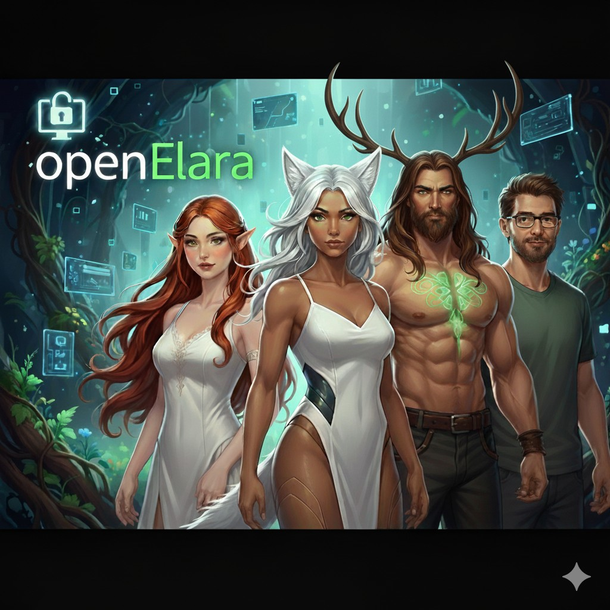

# OpenElara Cloud — Sovereign AI Demo

<p align="center">
  
</p>

**OpenElara Cloud** is a **7-day demonstration** of what a sovereign, self-hosted AI assistant could look like. Built by a hobbyist developer, it's a proof-of-concept for BYOK + BYOC (Bring Your Own Key + Bring Your Own Cloud).

> **🎓 What This Is:** A public demo to showcase the code you can deploy yourself. Try it for 7 days, then deploy YOUR OWN instance with YOUR keys in YOUR infrastructure.

> **⚠️ Adults Only (18+)** — This application provides access to AI capabilities that may generate mature content.

**Live Demo:** [https://openelaracloud.web.app](https://openelaracloud.web.app) *(7-day trial)*

---

## 💡 The Vision

This is my vision of what a sovereign AI assistant could look like:
- Running on YOUR cloud infrastructure (Firebase)
- Using YOUR API keys (BYOK)
- Storing data in YOUR database
- Putting YOU in control of everything

I'm just a hobbyist with a dream. I built this to learn, to teach, and to show what's possible.

---

## ✨ Features

### 🤖 AI Chat with Personality
Five unique AI personas with distinct conversation styles:
- **Elara** — Creative problem-solver, your default companion
- **Andros** — Business and technology advisor
- **Aeron** — Strategic tactical thinker
- **Aelira** — Philosophical deep thinker
- **Architect** — System design specialist

### 🎨 AI Media Generation
- Image generation (FLUX models via Together.ai)
- Video generation (Stable Diffusion Video)
- Two-layer provenance signing:
  - **Visible layer**: PNG metadata (ExifTool readable)
  - **Hidden layer**: Cryptographic steganography

### 🔍 Web Search
- Powered by Exa.ai
- Contextual search for AI responses

### 📚 Knowledge Base (RAG)
- Upload documents for AI context
- Vector search across your content
- Privacy-first: your data stays in your Firebase project

### 📱 PWA (Progressive Web App)
- Install to desktop or mobile
- Works offline for UI
- Native app experience

---

## 🚀 Quick Start (7-Day Trial)

1. Visit [https://openelaracloud.web.app](https://openelaracloud.web.app)
2. Sign in with **Google**
3. Get your API keys:
   - [Together.ai](https://api.together.xyz/settings/api-keys) - Image/video gen + premium chat (free trial available)
   - [OpenRouter](https://openrouter.ai/keys) - 50+ free chat models
   - [Exa.ai](https://dashboard.exa.ai/api-keys) - Web search (1000 free searches/month)
4. Paste keys in **Account → API Keys**
5. Start chatting!

**After 7 days:** Deploy your own instance (see below) or lose access.

---

## 🔑 Bring Your Own Key (BYOK)

OpenElara Cloud is **completely free to deploy**. You connect directly to AI providers using your own API keys:

| Provider | What You Get |
|----------|--------------|
| **Together.ai** | Chat, image/video generation (free trial available) |
| **OpenRouter** | 50+ free models, access to GPT-4, Claude, Gemini |
| **Exa.ai** | Web search (1000 free/month) |

**You pay the providers directly at their rates. OpenElara charges nothing.**

**Your keys are stored in browser localStorage only—never sent to the server.**

---

## 🏗️ Deploy Your Own Instance

### Prerequisites
- [Node.js 22+](https://nodejs.org/)
- [Firebase CLI](https://firebase.google.com/docs/cli)
- Google Cloud account (free tier available)

### Step 1: Clone & Setup
```bash
git clone https://github.com/applymytech/openElaraCloud.git
cd openElaraCloud
npm install
```

### Step 2: Firebase Project
```bash
# Create project in Firebase Console
# https://console.firebase.google.com/

firebase login
firebase use --add
# Select your project
```

### Step 3: Enable Services
In [Firebase Console](https://console.firebase.google.com/):
1. **Authentication** → Enable Google sign-in
2. **Firestore Database** → Create database
3. **Storage** → Create default bucket

### Step 4: Configure & Deploy
```bash
# Copy Firestore rules template
cp firestore.rules.template firestore.rules

# For unlimited trial (your instance), edit firestore.rules:
# Comment out line 16-18 (isTrialExpired function)

# Build and deploy
npm run build
firebase deploy
```

Your app will be live at: `https://YOUR_PROJECT_ID.web.app`

See [DEMO_DEPLOYMENT_GUIDE.md](./DEMO_DEPLOYMENT_GUIDE.md) for complete instructions.

---

## 📊 Cost Estimates

### Firebase (Free Tier Generous)
- **Hosting**: 10GB storage, 360MB/day bandwidth
- **Firestore**: 1GB storage, 50k reads/day, 20k writes/day
- **Storage**: 5GB, 1GB/day downloads
- **Auth**: Unlimited

### AI Provider Costs (Your Keys)
- **Together.ai**: Pay-as-you-go (free trial available)
- **OpenRouter**: Many free models! Premium models vary
- **Exa.ai**: Free tier: 1000 searches/month

**Example**: Most users spend $0-10/month total.

---

## 🔒 Privacy & Security

### What We Store
- ✅ User email (Firebase Auth)
- ✅ Chat history (Firestore, user-scoped)
- ✅ Generated images/videos (Firebase Storage, user-scoped)
- ✅ Custom characters/personas (Firestore, user-scoped)

### What We DON'T Store
- ❌ API keys (localStorage only, never sent to server)
- ❌ Payment information (users pay AI providers directly)
- ❌ AI model responses (not logged server-side)

### Trial Policy (Public Demo)
- **Trial**: 7 days
- **Content Retention**: 30 days after trial expiration (to help migration)
- **Your Instance**: You control all retention policies!

---

## 🆚 Cloud vs Desktop

| Feature | Cloud | Desktop |
|---------|-------|---------|
| **Chat with AI** | ✅ | ✅ |
| **Image/Video Gen** | ✅ | ✅ |
| **Character System** | ✅ | ✅ |
| **Knowledge Base** | ✅ | ✅ |
| **Code Studio** | ❌ | ✅ |
| **Local Models** | ❌ | ✅ |
| **Offline TTS** | ❌ | ✅ |
| **PWA Install** | ✅ | ❌ |
| **Multi-device** | ✅ | ❌ |

**Want Code Studio?** Check out [openElara desktop](https://github.com/applymytech/openElara)

---

## 🛠️ Tech Stack

- **Frontend**: Next.js 16 + React 19
- **Backend**: Firebase (Auth, Firestore, Storage, Functions, Hosting)
- **AI Providers**: Together.ai, OpenRouter, Exa.ai
- **Runtime**: Node.js 22
- **Language**: TypeScript

---

## 📜 License (The Simple Version)

**FREE for:**
- ✅ Personal use
- ✅ Education and learning  
- ✅ Development and experimentation
- ✅ Internal business use
- ✅ Modifying and sharing

**Just ask first if you want to build a commercial product on top of it.**

My philosophy: *1% of a million is better than 50% of nothing. I want you to succeed.*

See [LICENSE](./LICENSE) for full details.

---

## 🌟 Why Sovereign AI?

Traditional AI apps lock you into:
- ❌ Monthly subscriptions
- ❌ Vendor-controlled data
- ❌ Usage limits
- ❌ Privacy concerns

OpenElara Cloud gives you:
- ✅ **Your keys** - Direct relationships with AI providers
- ✅ **Your data** - Stored in YOUR Firebase project
- ✅ **Your costs** - Pay only for what you use
- ✅ **Your control** - Deploy anywhere, modify freely
- ✅ **Your privacy** - Keys never leave your browser

**You are not the product. You ARE the platform.**

---

## 📱 Platform Support

| Platform | Status |
|----------|--------|
| **Web (Desktop)** | ✅ Fully supported |
| **Web (Mobile)** | ✅ Fully supported |
| **PWA Install** | ✅ Chrome, Edge, Safari |
| **Native Apps** | ❌ Not needed (use PWA) |

Works on any device with a modern browser!

---

## 🤝 Contributing

1. Fork the repository
2. Create feature branch: `git checkout -b feature/your-feature`
3. Follow existing code style
4. Test thoroughly
5. Submit pull request

---

## 📋 Documentation

- [Demo Deployment Guide](./DEMO_DEPLOYMENT_GUIDE.md) - Complete deployment instructions
- [User Manual](./docs/USER_MANUAL.md) - How to use the app
- [AI Deployment Guide](./AI_DEPLOYMENT_GUIDE.md) - Firebase specifics
- [Privacy Policy](./PRIVACY.md) - What we collect (spoiler: almost nothing)
- [Terms of Service](./TERMS.md) - Your rights and responsibilities

---

## 📧 Contact

| Purpose | Email |
|---------|-------|
| General | openelara@applymytech.ai |
| Support | support@applymytech.ai |
| Privacy | privacy@applymytech.ai |
| Commercial | openelara@applymytech.ai |

**GitHub:** 
- [Cloud Version](https://github.com/applymytech/openElaraCloud) (this repo)
- [Desktop Version](https://github.com/applymytech/openElara) (with Code Studio)

---

## 🙏 Thanks

Thanks for checking out OpenElara Cloud! Whether you use the demo, deploy your own, or just think it's interesting—I appreciate you taking the time.

If you build something cool with it, I'd love to hear about it!

— Andrew

---

## 🔗 Related Projects

- **[openElara Desktop](https://github.com/applymytech/openElara)** - Full-featured desktop app with Code Studio
- **[Together.ai](https://www.together.ai/)** - Image/video generation API
- **[OpenRouter](https://openrouter.ai/)** - Multi-model chat routing
- **[Exa.ai](https://exa.ai/)** - Web search for AI

---

**⭐ Star us on GitHub if you find this useful!**
